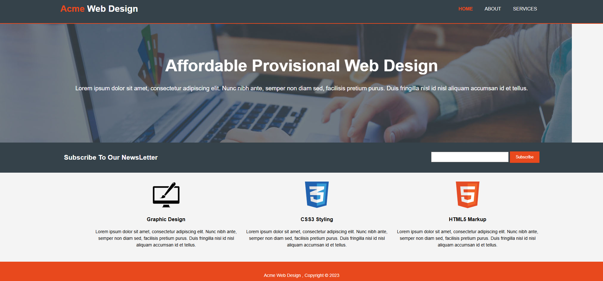
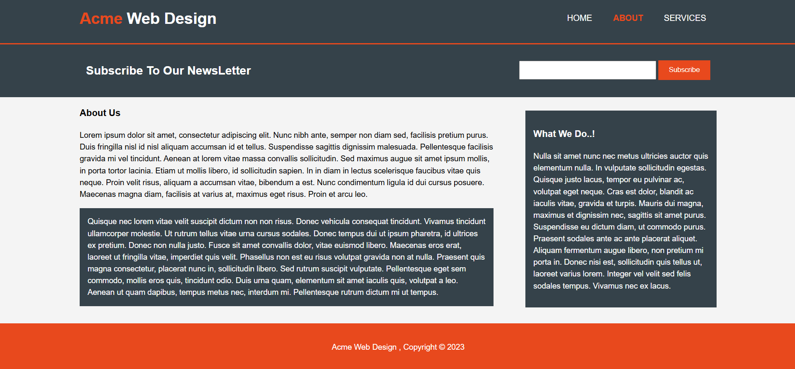
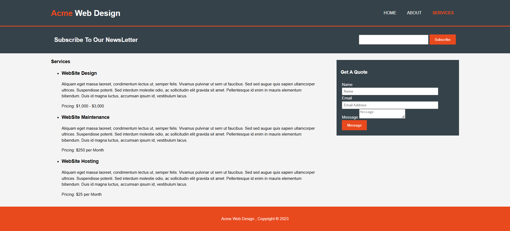

# 🌐 Acme Web Design – Affordable Provisional Web Design

A modern and fully responsive **web design service** providing affordable and high-quality frontend solutions using **HTML5, CSS3**.

## 🚀 About

**Acme Web Design** offers **affordable provisional web design** with a focus on **clean, modern, and responsive designs** for businesses and individuals.

## 🛠️ Topics

- 🎨 **Design**
- 🏗️ **HTML5**
- 💻 **Frontend Development**
- 🎭 **CSS3 Styling**

## 📷 Screenshots

| Home Page | About Page | Services Page |
|-----------|-----------|--------------|
|  |  |  |

## 🎯 How to Use

1. **Clone the Repository**  
   ```bash
   git clone https://github.com/hadialkari/Acme-Web-Design.git
   cd Acme-Web-Design

2. **Open `index.html` in your browser**  
   Simply open the file, and the site will load.

## 📜 License

This project is **open-source**
